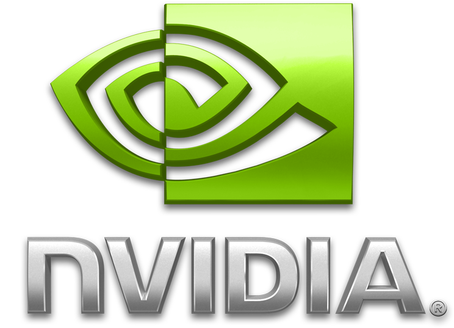

# Hey👋, I'm Irfan Sipai! | Python AI/ML Developer 🚀

<p align="center">
  Welcome! I'm an Electrical Engineering graduate turned Python AI/ML Developer with 1.5 years of hands-on experience at Autobits Labs. I specialize in building intelligent systems, backend microservices, and automation tools from the ground up, with a strong focus on performance and reliability. I thrive on dissecting complex problems and delivering robust, well-researched solutions.
</p>

## About Me 🧑‍💻

- 🛠️ Building high-performance AI/ML systems (Computer Vision focus).
- 🚀 Designing and implementing backend microservices (FastAPI, Flask, Django).
- ⚡ Optimizing for real-time processing and GPU acceleration (CUDA, ONNX Runtime).
- ☁️ Experienced with containerization (Docker, Docker Compose) and Linux environments (Ubuntu).
- 🌱 Always learning and exploring new technologies in AI, backend development, and cloud platforms.
- 🤝 Open to collaborating on interesting projects and discussing innovative ideas.
- 💼 Seeking challenging opportunities as a Python AI/ML Developer.

## Skills - Languages & Tools 🛠️

<p align="center">
  <a href="https://www.python.org/" target="_blank" rel="noreferrer">
    
  </a>
  <a href="https://pytorch.org/" target="_blank" rel="noreferrer">
    
  </a>
  <a href="https://www.tensorflow.org" target="_blank" rel="noreferrer">
    
  </a>
   <a href="https://onnx.ai/about.html" target="_blank" rel="noreferrer">
     
   </a>
  <a href="https://developer.nvidia.com/cuda-zone" target="_blank" rel="noreferrer">
     
   </a>
  <a href="https://fastapi.tiangolo.com/" target="_blank" rel="noreferrer">
    
  </a>
  <a href="https://flask.palletsprojects.com/" target="_blank" rel="noreferrer">
    
  </a>
  <a href="https://www.djangoproject.com/" target="_blank" rel="noreferrer">
    
  </a>
  <a href="https://opencv.org/" target="_blank" rel="noreferrer">
    
  </a>
  <a href="https://ffmpeg.org/" target="_blank" rel="noreferrer">
    
  </a>
  <a href="https://www.postgresql.org/" target="_blank" rel="noreferrer">
    
  </a>
   <a href="https://redis.io" target="_blank" rel="noreferrer">
     
   </a>
  <a href="https://docs.celeryq.dev" target="_blank" rel="noreferrer">
     
   </a>
  <a href="https://www.docker.com/" target="_blank" rel="noreferrer">
    
  </a>
  <a href="https://git-scm.com/" target="_blank" rel="noreferrer">
    
  </a>
  <a href="https://www.linux.org/" target="_blank" rel="noreferrer">
    
  </a>
  <a href="https://developer.mozilla.org/en-US/docs/Web/JavaScript" target="_blank" rel="noreferrer">
    
  </a>
  <a href="https://reactjs.org/" target="_blank" rel="noreferrer">
    
  </a>
</p>

## Estimated Coding Activity (Last ~1.5 Years)

```txt
(approx. 2500 hours)

Python (Backend, AI/ML)       █████████████▓░░░░░░░░░░░   55.0 %
Docker & DevOps               █████░░░░░░░░░░░░░░░░░░░░   20.0 %
Git & Collaboration           ███▒░░░░░░░░░░░░░░░░░░░░░   15.0 %
Linux & Shell                 ██░░░░░░░░░░░░░░░░░░░░░░░   05.0 %
Frontend (JS/React/HTML/CSS)  ██░░░░░░░░░░░░░░░░░░░░░░░   05.0 %
```

_Note: This is an estimation based on project focus over \~1.5 years of professional experience._

## ✨ Featured Projects

### [1\. Real-Time Face Recognition & Surveillance Platform (FastAPI Microservices)](https://github.com/vxedit/face-rec-services)

- **Description:** Designed and built a high-performance, scalable platform for real-time face recognition across multiple IP cameras. Features include live monitoring, subject management, access control, and analytics via a web dashboard. (Developed professionally at Autobits Labs - _Source code is proprietary_).
- **Key Features & Concepts:**
  - Decoupled microservices architecture (FastAPI Control & Processing services).
  - GPU-accelerated AI (InsightFace/ONNX Runtime) for detection & recognition.
  - Self-healing video streams (FFmpeg/CUDA) with automatic restarts for high availability.
  - Real-time dashboard updates via WebSockets.
  - Asynchronous operations (`asyncio`, `SQLAlchemy`, `httpx`).
  - Comprehensive permission system & background notification service.
  - Fully containerized with Docker and Docker Compose.
- **Skills Demonstrated:** Backend Development, Microservices, AI/ML Integration, GPU Acceleration, Real-Time Systems, Database Design (PostgreSQL), Docker, Performance Optimization, System Resilience, FFmpeg Pipelines, Asynchronous Programming.

### [2\. Real-Time Indian Sign Language Recognition with Speech Output](https://github.com/vxedit/isl-sign-recognition)

- **Description:** An application that uses a webcam to detect hand gestures (ISL for 0-9, A-Z) in real-time via MediaPipe, classifies them using a TensorFlow/Keras model, and provides spoken feedback using asynchronous text-to-speech. Features prediction debouncing for stability.
- **Technologies:** Python, TensorFlow/Keras, MediaPipe, OpenCV, NumPy, `threading`, `queue`, `pyttsx3`.
- **Skills Demonstrated:** Computer Vision, ML Model Integration, Real-Time Processing, Concurrency (Threading), UI Feedback (Visual & Audio).

### 3\. Chili Powder Quality Analysis (ML Model)

- **Description:** Developed machine learning models (PLSR, Transformers) using TensorFlow to predict pigmentation and capsaicinoid concentrations in chili powder from spectrography data.
- **Results:** Increased pigmentation prediction accuracy by 20% and capsaicinoid prediction accuracy by 15% compared to baseline models.
- **Skills Demonstrated:** Machine Learning, Data Analysis (Pandas, NumPy), Model Development (TensorFlow), Regression, Feature Engineering, Spectrography Data Handling.


## 📫 Connect with Me

<p align="left">
    <a href="https://www.linkedin.com/in/extremesecret0/" target="blank"></a>
    <a href="https://leetcode.com/u/ExtremeSecret0/" target="blank"></a>
    <a href="mailto:ee.irfansmail@gmail.com" target="blank">
    
    </a>
</p>

---
